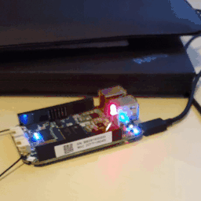

## Blinking a LED with Rust

Use `sysfs_gpio`

This following program blinks an LED on and off every 2 seconds

```rust
extern crate sysfs_gpio;

use sysfs_gpio::{Direction, Pin};
use std::thread::sleep;
use std::time::Duration;

fn main() {
    let my_pin = Pin::new(68);
    println!("{:?}", my_pin);

    my_pin.with_exported(|| {
        my_pin.set_direction(Direction::Out).unwrap();
        loop {
            my_pin.set_value(0).unwrap();
            sleep(Duration::from_millis(1000));
            my_pin.set_value(1).unwrap();
            sleep(Duration::from_millis(1000));
        }
    }).unwrap();
}
```

Success!




### Resources

http://rust-embedded.github.io/rust-sysfs-gpio/sysfs_gpio/index.html


## Adding racer support to Atom
```
rustup component add rust-src
```

```
sudo cargo install racer
```

Set the following:

- bin_dir: `/home/cwoodall/.cargo/bin/racer`
- src_dir: `/home/cwoodall/.multirust/toolchains/stable-x86_64-unknown-linux-gnu/lib/rustlib/src/rust/src/`
- optional cargo dir: `/home/cwoodall/.cargo`

## Adding build_deploy script

Builds, and then syncs the build to the beagle bone. Afterwards it runs the program, when exiting the terminal it kills the program if it did not exit elegantly when the ssh terminal was closed.

```
cargo build --target arm-unknown-linux-gnueabihf
rsync target/arm-unknown-linux-gnueabihf/debug/rusty-nail root@beaglebone.local:~/rusty-nail
ssh root@beaglebone.local ./rusty-nail
ssh root@beaglebone.local pkill -9 rusty-nail
```

## Future Items/Resources

Use [toml-rs](https://github.com/alexcrichton/toml-rs) to configure pin mapping for the program.
